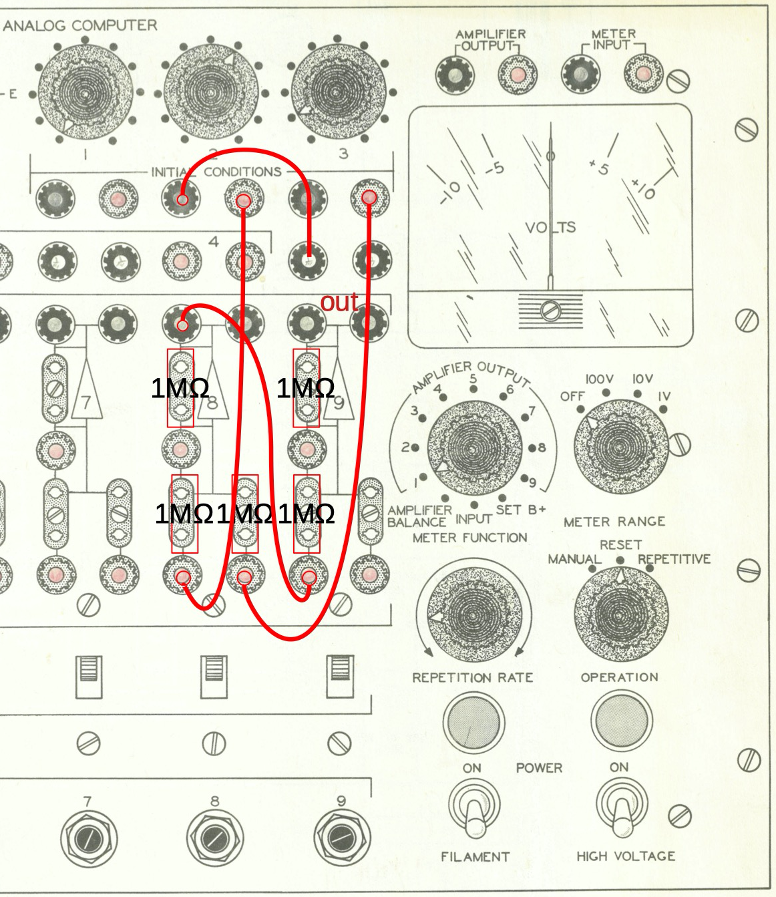
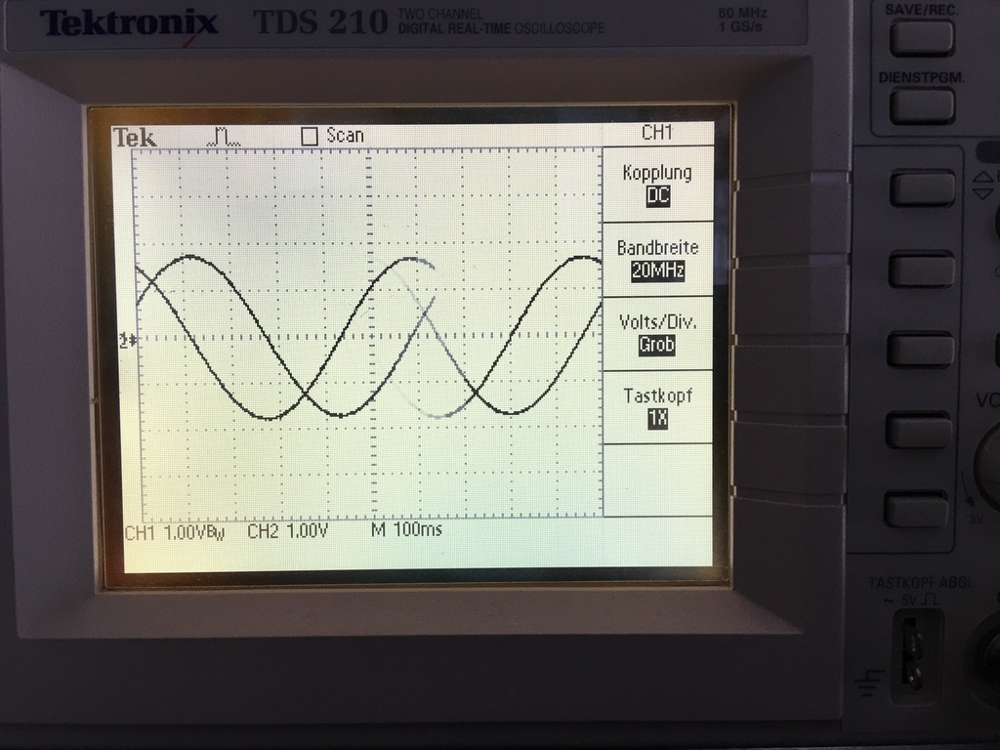
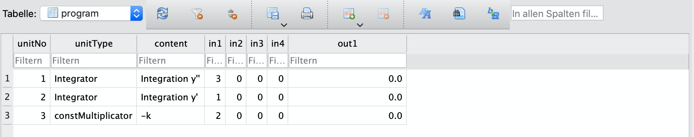

# Analog Computing - Programming without a language
a project directly related to current research 
### Klaus Paschenda 10/2020

---

>> Implement a program that simulates an analog computer with the possibility to run different analog programs on the simulated machine.

---

## Table of contents
* [1. Background](#1.-Background)
* 1.1. What is the idea of an analog computer?
* 1.2. A very simple example
* 1.3. What is the main advantage of an analog computer? 
* 1.4. The very simple example in real life: Hello world!
* 1.5. And more
* [2. Motivation](#2.-Motivation)
* [3. Requirements and Simplifications](#3.-Requirements-and-Simplifications)
* [4. Walkthrough](#4.-Walkthrough)
* [5. Chosen Technologies](#5.-Chosen-technologies)
* [6. Overview of the solution](#6.-Overview-of-the-solution)
* 6.1 We enter data, these are the potentiometers.
* 6.2 We program the analog computer.
* 6.3 We run the computer.
* 6.4 The output
* [7. An example how to do it: Solving a very simple differential equation with an analog computer](#7.-An-example-how-to-do-it:-Solving-a-very-simple-differential-equation-with-an-analog-computer)
* 7.1. We draw the flow diagram.
* 7.2 We create the database: harmonic_oscillator.db.
* 7.3 We create and fill the table 'program'.
* 7.4 We fill the table 'ic'.
* 7.5 We start acsim, enter the number of truns n and the time step dt and run 'program'.
* 7.6 We look at the results.
* 7.7 And plot the results.
* [8. Testing](#8.-Testing)
* [9. Looking at the Code](#9.-Looking-at-the-Code)
* [10. Standard examples for analog computing](#10.-Standard-examples-for-analog-computing)
* 10.1. The most simple Predator-Prey System
* 10.2. The Mass-Spring-Damper System
* [11. Discussion](#11.-Discussion)
* [12. Features of acsim](#12.-Features-of-acsim)
* [13. Links](#13.-Links)
* [14. Status](#14.-Status)
* [15. Credits](#15.-Credits)
* [16. Contact](#16.-contact)

---
---

## *1. Background*
### *1.1. What is the idea of an analog computer?*
> An analog computer is a special form of a computer and was mainly used to solve dynamic problems. The basic principle is first to build a model of a process, usually in mathematical form as differential equations. Such a mathematical model is then translated in a further step into a physical model, which is formed by an analog computer. 

### *1.2. A very simple example* 
Two highways are merged into one. The resulting number of cars per time unit is equal to the sum of the cars of the previous highways. This is the mathematical model: 

cars_1/time_unit + cars_2/time_unit = all_cars/time_unit 

Such a simple addition can be realized physically with an electric circuit of three resistances. Remember Kirchhoff's current law: The algebraic sum of currents in a network of conductors meeting at a point is zero.

i1 + i2 + i3 + ... = 0 

The current i is positively or negatively signed according to the direction towards (i1, i2) or away (i3) from the node. So the electrical model for the car-equation is

i1 + i2 = i3

Now we make an analog computer out of it: 

With the two potentiometers we enter the numbers to be added i.e. we set the current intensity, the measuring device on the right-hand side shows the result. Usually a symbol notation is used. For the highways we have this flow diagram.

Classical analog computer have a set of different operation units:

(from: Joseph J. Blum, Introduction to Analog Computation, Harcourt, Brace & World, Inc.New York 1969)

As summer and integrators in classical analog computers always invert the sign, we need two summers or one summer and one inverter for the highway problem.

### *1.3. What is the main advantage of an analog computer?*

Beside its incredible speed the most important property of an analog computer is its ability to integrate.

Let us take a bucket into which water flows from a water crane. We can set how much water per minute flows into the bucket. This is the change of the amount of water in the bucket. The bucket stores the water. If 1 l/min flows into the bucket, after 3 minutes there are 3 l of water in the bucket. Mathematically speaking, the water in the bucket is the sum of the water that flows into the bucket or, to put it sloppily, the bucket is the integral of the water crane. (Metereologists measure the amount of precipitation this way.)

This example can easily be modelled electrically. If a capacitor is charged with a constant current (flowing water), the amount of charge in the capacitor (water in a bucket) is mathematically the integral over the input current.

The integrator unit uses this physics.

Generally speaking: An analog computer provides physical, mostly electrical systems that the user cleverly connects to each other. The computer does the calculations on its own. Only models are selected. Therefore it is a form of declarative programming. 

> ## Programming the analog computer means to write a flow diagram with the symbols and then patch the units according to the flow diagram. 

### *1.4. The very simple example in real life: Hello world!*

This is the simple addition on the Heathkit EC-1:

We use the potis 'INITIAL CONDITIONS' for the input of two numbers. The left unit number 8 is an Summer with two inputs. You can see the resistors, compare to the electrical circuit above. Unit 9 ist an Inverter. The Meter shows the result. It's a little like 'Hello World!' For the life demonstration see the video.

### *1.5. And more*

But an analog computer can do really great things:

Already in 1956 a rocket was really a dynamic problem.

Today there are many tools to solve dynamic problems on digital stuff: Berkeley Madonna, Vensim, Wolfram, Matlab, LabView ... 

And applications of System Dynamics, for example En-ROADS, climate crisis, sars crisis and so on.

___

## *2. Motivation*
This project is only meant to demonstrate that it is possible to simulate an analog computer. It is a proof of concept. Among other things, a numerical integration method is required, which directly impacts the precision of calculations. In this project, questions of timing, accuracy, scaling are not discussed. 

Why this project? Currently there are recurrent references to the approach of analog computing, e.g. in neuromorphic engineering. (See chapter: Discussion)

And personally: I love old technology. 

___

## *3. Requirements and Simplifications*
* no graphical user interface, command line is ok
* a simple usable interface for the analog program: initial conditions (inputs) and program itself
* a graphical output
* a solution to save the analog program and the results, also to export
* no dynamical variations of inputs (like a flight simulator for example)
* 10 analog computing units
* variable time-steps dt to control the accuracy of the numerical integration
* variable number of integrations
* solve the mass-spring-damper system
* solve the simplest predator-prey system

___

## *4. Walkthrough*
First we need a control for the simulated analog computer. Within the program 'acsim' this is the outer loop. Starting this program means switching on the computer (Switch: power on). Now the computer is ready to receive user input: 
* Which analog program should be executed?
* What are the parameters, e.g. how long should be calculated?
* start the analog program for the entered time
* show the results
* end the program = switch off the analog computer

With 'run', the simulated analog computer reads in the desired program with the set values, then it performs and saves the calculations. Since dynamic processes are to be calculated, the flow diagram must be run repeatedly through again: Results at time t1, at time t1+dt, at time t1+dt+dt etc. A middle loop controls the number of runs.
The actual calculation, i.e. the one-time step-by-step processing of the flow diagram for one point in time, is done by an inner loop. The mathematical operations can be defined as functions, which are called by this loop.
The analog program itself is stored in a database by two tables: Table 'initial conditions' and table 'program'. The results of the simulation are also stored in this database.
The results can then be output in tabular or graphical form.

For a demonstration watch: https://youtu.be/N8zDZByInOM  

___

## *5. Chosen Technologies*
* language: Python version 3.8.5 64-bit (learned in week 6) 
* storage: SQLite database (learned in week 7)
* input, output, analog programming: DB-Browser SQLite version 3.12.0
* graphical output: matplotlib.pyplot
* IDE: VS Code version 1.49.3 on Mac OS version 10.15.6
* terminal: version 2.10

and real life analog computers
* Heathkit EC-1, introduced in 1960 by Heathkit
* GTE 22 (comparable to Telefunken RAT 700 series)

___

## *6. Overview of the solution*
Let us look at a real life analog computer. 

### *6.1 We enter data, these are the potentiometers.* 

> For these we have three informations: which potentiometer, which variable should it be, which value should it have. This could be a list of lists, but a table is clearer. In the database this is the table 'ic' (= initial conditions).

### *6.2 We program the analog computer.* 

> We choose the desired units on the board, then the units are connected with cables according to the flow diagram, i.e. which input receives which output. In the database this is the table 'program'. Since integrators often do not start at zero, the initial conditions have to be considered here.

### *6.3 We run the computer.*

The basic operation method for integration is the Euler method:
In mathematics and computational science, the Euler method (also called forward Euler method) is a first-order numerical procedure for solving ordinary differential equations (ODEs) with a given initial value. (wikipedia.org)

Real world: 
That’s one small step for a man, one giant leap for mankind. (Neil Armstrong, July 21, 1969)

If we repeat the small step, we can travel to the future, but the problem is: the slope of the function is changing also. Analog computer can solve this (mostly), as we can see in the example.

> The analog computer is operated at the control unit. This is the outer loop in the Python-program.

### *6.4 The output* 
> The output of the results was mostly done either on an x-y writer or with an oscilloscope. 

> Here all calculation steps are logged in a table. This is the JobTable in the database. Thus they are permanently available for an export. Within the software environment of the simulation program 'acsim', the graphs can be displayed and saved using the Python library matplotlib.

Overall, we need a database for each dynamical problem.

___

## *7. An example how to do it: Solving a very simple differential equation with an analog computer*

Let's take this equation y''(t) = - k * y(t). One applacation of this equation is a ideal mass-spring system.

### *7.1. We draw the flow diagram.*

We start with the highest derivation and assume that we know y''. Integration of y'' over the time gives us y'. In physics this is the step from the acceleration to the velocity. In the next step we integrate y' to y, now we know the displacement of an ideal mass-spring-system. For the left side of the equation we need this y and multiply it with -k. This is then y'', the input of the first unit.
We start with the initial condition y''0 = 0.5, physically this is the start accelaration. 

### *7.2 We create the database: harmonic_oscillator.db.* 

### *7.3 We create and fill the table 'program'.*

Unit 1 gets the output from unit 3, unit 2 gets the output from unit 1 and unit 3 gets the output from unit 2. 

**That's programming without a language.**

You can also look at it this way: The table is a kind of "declarative programming" (as opposed to "imperative programming", as for example in Python or in a recipe).

### *7.4 We fill the table 'ic'.* 

The first integrator starts with 0.5. Do not be surprised about the value of the constMultiplicator. It was chosen for easy testing, see below.

(Some columns are reserved for controlling.)

### *7.5 We start acsim, enter the number of turns n and the time step dt and run 'program'.*

### *7.6 We look at the results.*

t  is:  [0.0, 0.025, 0.05, 0.07500000000000001, 0.1, 0.125, 0.15000000000000002, 0.17500000000000002, 0.2, ...

y1 is:  [0.5, 0.5, 0.4876629944986383, 0.4632933869053962, 0.42749247318616135, 0.38114360547994974, ...

y2 is:  [0.0, 0.0125, 0.02469157486246596, 0.036273909535100866, 0.046961221364754904, 0.056489811501753646, ...

y3 is:  [0.0, -0.49348022005446757, -0.9747843037296849, -1.432036548769394, -1.853954708248465, -2.2301283688576623, ...

### *7.7 and plot the results.*

That's it. :-)

___

## *8. Testing* 
1) From mathematics we know the solution for the ideal harmonic oscillation:

   
2) and compare with the Python analog computer: We used k = 4 * pi^2, that means T = 1. So in the plot above we zoom in at t = 1. The plot shows the difference. The green graph should cross at t=1 the value y=0.

3) And for the value look at the job table: The error is 2 %, the main reason is the Euler-method as basis for the calculation. There are better methods for numerical integration.

4) Last not least: Plotting Lissajous figures is also a nice testing (see video).

___

## *9. Looking at the Code*

The program acsim...py (analog computer simulation) gives us the user interface für controlling the analog computer and the simulation routines. The Programming of the analog computer ist done with a sqlite database, which is already explored above.

First we need some imports:

`import time` 
`import sqlite3` 
`import math` 
`import matplotlib.pyplot as plt`

The MAIN part contains the outer loop for getting the user inputs:

`while menu:` `
    print("""` `
    digital simulation of analog computing - dac 2020` `
    -----------------------------------------------------------` `
    c = change the database with the analog program` `
    n = number of turns, time scale` ` 
    r = run: initialize and do the job` `
    p = plot: show the results as graph` `
    q = quit: close the database and exit the simulation` `
    -----------------------------------------------------------` `
    """)` `
    menu = input("What would you like to do? ")` `
    if menu == "c":` `
    elif menu == "n":` `
    elif menu == "r":` `
    elif menu == "p":` `
    else:` `
       print("Not a valid choice !")` 

In the middle loop

`def runTurns(nameJobTable):` `
...` `
turnNo = 1` `
    while turnNo <= int(turnNoMax):` `
    ...`

we control the number of turns and therefore the time:  
Running time = (number of turns) * dt.  
Important: The time scale of the programm is arbitrary and is not connected to seconds or so. The DEs define the time scale. The user can for example choose a year or a second as time step of the program. 

The inner loop is one run through the chain or the network of the flow diagram. We look for the changes in one time step dt.

`def turn(turnNo, currentTime, nameJobTable):` `
    stepNo = 1` `
    ...` `
    while stepNo <= stepNoEnd:` `
    ...`

This inner loop calls the function 'execute':

`def execute(unitType, currentTime, in1Value, in2Value, in3Value, in4Value, turnNo, unitNo, nameJobTable):` `
    if unitType == 'Potentiometer':` `
    elif unitType == 'Adder':` `
    elif unitType == 'Inverter': # mal Faktor -1` `
    elif unitType == 'Multiplicator':` `
    elif unitType == 'constMultiplicator':` `
    elif unitType == 'Divider':` `
    elif unitType == 'Integrator':` `
    elif unitType == 'Sinus-Generator':` `
    else:` `
        print('unitType not found')` `
        return()`  

The 'Adder' is very simple:

`elif unitType == 'Adder':` `
        out1 = in1Value + in2Value + in3Value + in4Value` `
        return(out1)`

The 'Integrator' is a some more code. For simplicity I use Euler's method for the numerical integration (see above). The basic idea is simple. We need 
dy/dt at any point (t,y). According to Euler we start by an y-value, say yl (y-left) and estimate the next y-value (y-right) with this formula

yr = yl + slope * dt

The feedback we see in a flow diagram changes the slope for the next interval. So we can generate a sequence of y-values. The amount of the time step dt must chosen appropriately small. That's the job of the user.

In the function we must look for the start condition. For example if you expand a spring you have an initial condition for the acceleration.

`if turnNo == 1:` `
            # The initial conditions of the integrators are taken into account here.` `
            createSql = 'SELECT ic5 FROM ic WHERE unitNo = ' + str(unitNo)` `
            y0 = (list(cursor.execute(createSql))[0])[0] # in ic 5 is the value of the initial condition` `
            # we update the Jobtable with this initial condition` `
            outColumn = 'outU' + str(unitNo)` `
            createSql = 'UPDATE ' + nameJobTable + ' SET ' + outColumn + ' = ' + str(y0) + ' WHERE turnNo = 0'` `
            cursor.execute(createSql)`

The initial condition is the last value for the Euler step: 

`# we write the initial condition to ic1, which is the last value of yl` `
createSql = 'UPDATE ic SET ic1 = ? WHERE unitNo = ?'` ` 
data_tuple = (y0, unitNo)` ` 
cursor.execute(createSql, data_tuple)`
            
Finally we execute:

`# yr = yl + in1Value * dt (Euler)` `
createSql = 'SELECT ic1 FROM ic WHERE unitNo = ' + str(unitNo)` `
yl = (list(cursor.execute(createSql))[0])[0]` ` 
out1 = yl + in1Value * dt`    
`# we save out1 in ic1 of the unit` `
createSql = 'UPDATE ic SET ic1 = ? WHERE unitNo = ?'` `
data_tuple = (out1, unitNo)` ` 
cursor.execute(createSql, data_tuple)` `
return(out1)`

The rest is logging in the job table and plotting using the library matplotlib.pyplot (see above).

___

## *10. Standard examples for analog computing*

### *10.1. The most simple Predator-Prey System*

A simple robber-prey system was created by the sale of fur. We start here: Number of snow hare and lynx skins purchased by the Hudson Bay Company from 1845 to 1935.

You know, that Canada lynxes eat snowshoe hares. Lotka-Volterra have established a system of DEs for this purpose, 
from wikipedia.org:

These equations are represented by the following flow diagram:

Then we fill table 'program' in the database:

Running the program with arbitrarily chosen A, B, C, D solves the DE-system in a qualitative manner:

We can see the typical wave shape af a predator-prey-system. Yes, I know, there are only whole animals, the curves should be stepped. But for large populations continuous curves are used.

> This example shows that is possible to solve systems of DEs with an analog computer and the program here of course. And: We do not need a special language.

___

### *10.2. The Mass-Spring-Damper System*

This is a classic of physics and mathematics to solve a simple 2nd order ODE. The problem is this situation:

The picture is from: https://courses.lumenlearning.com/suny-osuniversityphysics/chapter/15-5-damped-oscillations/

There you will also find the explanations and discussion of the different results. The ODE is:

After all the stuff above I omit the flow diagram and the table 'program' here. This is one plot of acsim.py:

___

## *11. Discussion*

The project demonstrates that it is possible to simulate an analog computer. The usability is very cumbersome, but this is a problem of computer science that has been solved many times. 

Of course you can use programs to simulate electronic circuits like LTspice, but this is very cumbersome.

In the past there have been occasional attempts to simulate an analog computer when Aplle IIe, C64 etc. were new. 

In popular computer and electronic magazines of that time you can find things like this one from popular electronics december 1961:

However, they have been forgotten in the course of time. I have not researched further, it is difficult and takes a lot of time.

The current book by Bernd Ulmann, Analog Computing, 2013, which gives a good overview of the topic 'analog computers', contains 11 pages from about total 430 pages about the simulation of analog computers. So this project has a certain importance, especially because there is an increasing interest in analog computing again.

One reason is the energy consumption: 
"The most commonly cited advantage of continuous time analog computation is the energy efficiency of using analog variables, albeit for low-precision solutions only. The reason using analog encodings is efficient is because an analog encoding packs more data on a single wire, and because many analog operations are cheaper compared to digital. While that case for analog is intuitive and appealing, a quantitative comparison between analog and digital encodings show analog is more efficient than digital only for low-precision data." (Yipeng Huang, Hybrid Analog-Digital Co-Processing for Scientific Computation, dissertation COLUMBIA UNIVERSITY 2018, p. 11) 

This property leads directly to a current research area:

Here is an example: 
>In the field of neuromorphic engineering, researchers study computing techniques that could someday mimic human cognition. Electrical engineers at the Georgia Institute of Technology recently published a "roadmap" that details innovative analog-based techniques that could make it possible to build a practical neuromorphic computer.

>A core technological hurdle in this field involves the electrical power requirements of computing hardware. Although a human brain functions on a mere 20 watts of electrical energy, a digital computer that could approximate human cognitive abilities would require tens of thousands of integrated circuits (chips) and a hundred thousand watts of electricity or more – levels that exceed practical limits.

>The Georgia Tech roadmap proposes a solution based on analog computing techniques, which require far less electrical power than traditional digital computing. The more efficient analog approach would help solve the daunting cooling and cost problems that presently make digital neuromorphic hardware systems impractical. 

>"To simulate the human brain, the eventual goal would be large-scale neuromorphic systems that could offer a great deal of computational power, robustness and performance," said Jennifer Hasler, a professor in the Georgia Tech School of Electrical and Computer Engineering (ECE), who is a pioneer in using analog techniques for neuromorphic computing. "A configurable analog-digital system can be expected to have a power efficiency improvement of up to 10,000 times compared to an all-digital system."
 
(from: https://phys.org/news/2014-04-neuromorphic-roadmap-envisions-analog-path.html) 

And some more:

* Neuromorphic computing is much better candidate for next-gen computation.
(2020 https://www.geeksforgeeks.org/neuromorphic-computing/)
* Analog neuromorphic computing using programmable resistor arrays
(2019 https://www.sciencedirect.com/science/article/abs/pii/S003811011830707X)
* Accelerated Analog Neuromorphic Computing
(2020 https://www.groundai.com/project/accelerated-analog-neuromorphic-computing/1)

This is a possible bridge to my project:

(2015 from https://digitalassets.lib.berkeley.edu/techreports/ucb/text/EECS-2015-218.pdf)

If we look further, enjoy this video:

Analog Supercomputers: From Quantum Atom to Living Body | Rahul Sarpeshkar | TEDxDartmouth

https://www.youtube.com/watch?v=ZycidN_GYo0

From there: 

Do you remember the shape ?

___

## *12. Features of acsim*
* __Awesome feature 1:__ 
### With a simple program and a database is programming without a language possible.
* __Awesome feature 2:__ 
### Classical analog computers can simulated with digital equipment, but there a some disadvantages in the digital world. 
* __Awesome feature 3:__ 
### The project is directly related to current research, for example neuromorphic engineering, and therefor to AI.

___

To-do: 
__Look again to the advantages of analog computing and compare with the simulation:__
* Programming means to change the structure of the computer.
* That's all to do, the rest will be done by the system.
* Another point of view: Everything is a control loop. This means solving DEs, that's the job of an analog computer.
* Impossible on digital stuff: A analog computer scales flat in inflection to the computing time.
* Not worth the trouble: You can not hack an analog computer.

And the trivialities:
* Implement Interactivity: Turning the potentiometer in the current execution.
* Implement the HALT-function
* Use multithreading
* Div. improvements in the source code
* Div. improvements in the database
* Div. improvements in the user interface

___

## *13. Links*
You find this file at: 
https://github.com/YukanQ/analog-computing

There are two videos according to this project.
* **Analog Computing - Programming without a Language** - the very short one for CS50 [digital analog computing](https://youtu.be/N8zDZByInOM)
* and with some more details **Digital Simulation of an analog Computer** [analog computing - programming without a language](https://youtu.be/gKRJvYr9yqE)

and:
* a simple addition with an analog computer Heathkit EC1: hello world   https://youtu.be/xeBFbKn_DvY
* harmonic oscillation simulated on an analog computer GTE22 
https://youtu.be/cD6qtKBeAjg 

___

## *14. Status*
The Project for CS50 is _finished._

___

## *15. Credits*
Many thanks to David J. Malan, Brian Yu, Doug Lloyd and all the others from CS50. 

___

## *16. Contact*
Created 10/2020 in France by [Klaus Paschenda](mailto:paschenda@mac.com) - feel free to contact me!

___

&copy; Klaus Paschenda